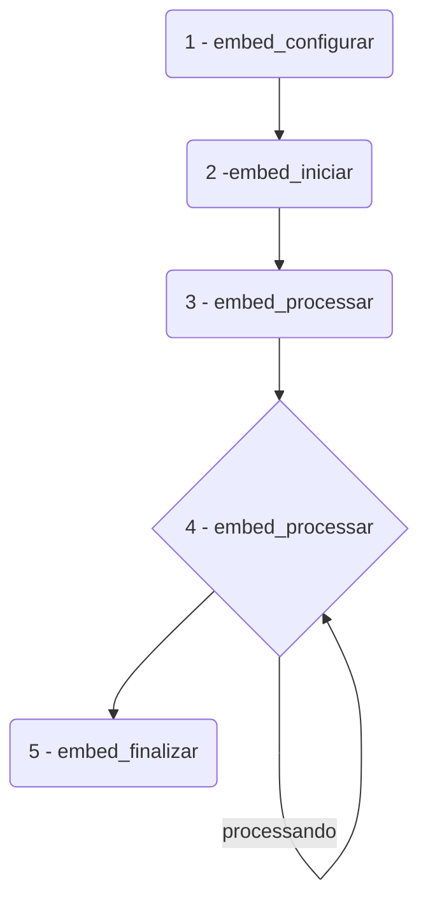

# example-lib-embed-python-xml

Exemplo que demonstra o uso da `lib-embed` para o uso de envio de XMLs.

## Instalação

### Requisitos
É necessário ter o Python 3 instalado na sua máquina.

Clonar o exemplo:
```
git clone git@github.com:org-dev-embed/example-lib-embed-python-xml.git
```

acessar a pasta, modificar o arquivo .env.example, renomeando para .env e colocando os valores
passados pelo time de suporte. Feito isso, executar o programa com python
```
cd example-lib-embed-python-xml
mv .env.example .env
python3 embed_example.py
```
### Fluxo da API
